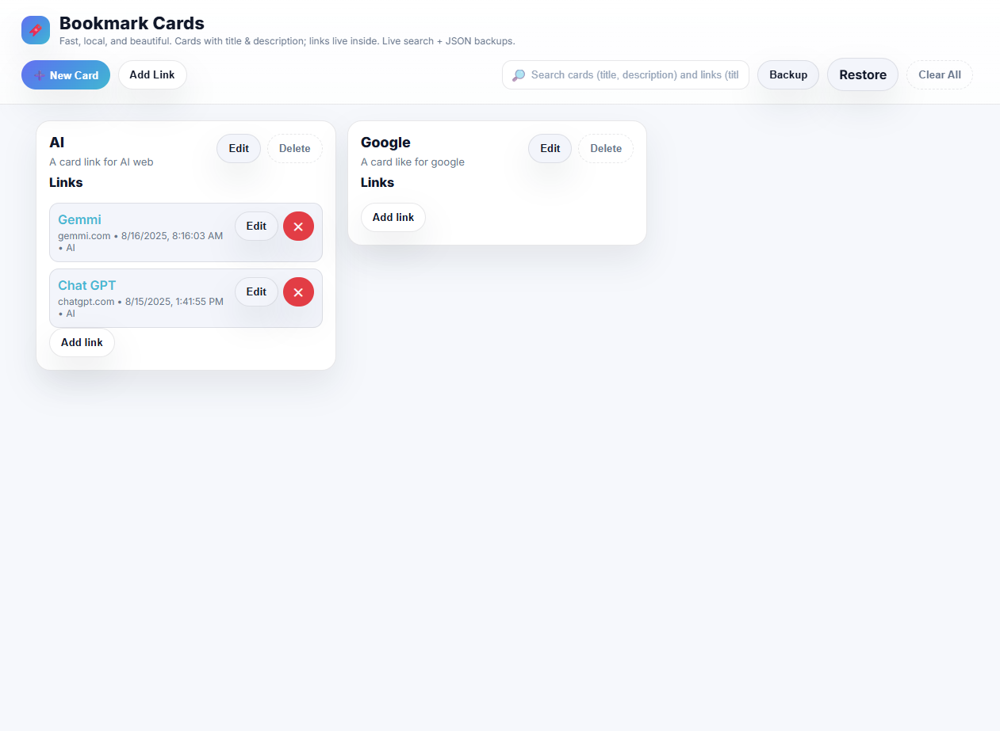

# 📑 Bookmark Cards (v3)

A sleek, self-hosted bookmark manager built with **HTML + CSS + JavaScript**.
- Cards have **Title** and **Description**
- Links live inside each card
- Enhanced **live search** with highlights
- JSON **Backup/Restore**
- Runs locally or on GitHub Pages (no backend)

## 🖼 Preview

  

## What’s new in v3
- **Fix:** Adding a link from inside a card adds it to **that card** (no regroup by host)
- **New:** **New Card** button & modal
- **Schema:** Groups keyed by random id (not host). Includes **migration** from older versions.
- **UX:** Modern lighter theme, rounded pill buttons, softer shadows

## Files
- `index.html` — structure + modals
- `style.css` — modern light theme
- `scripts.js` — logic (CRUD, search, storage, migration)

## Run Locally
Just open `index.html` in your browser. Data is stored in `localStorage` (`bookmarkGroups.v3`).

## GitHub Pages
Upload these files to a GitHub repo, enable **Settings → Pages** → branch `main` / folder `/root`.

## License
MIT
"""